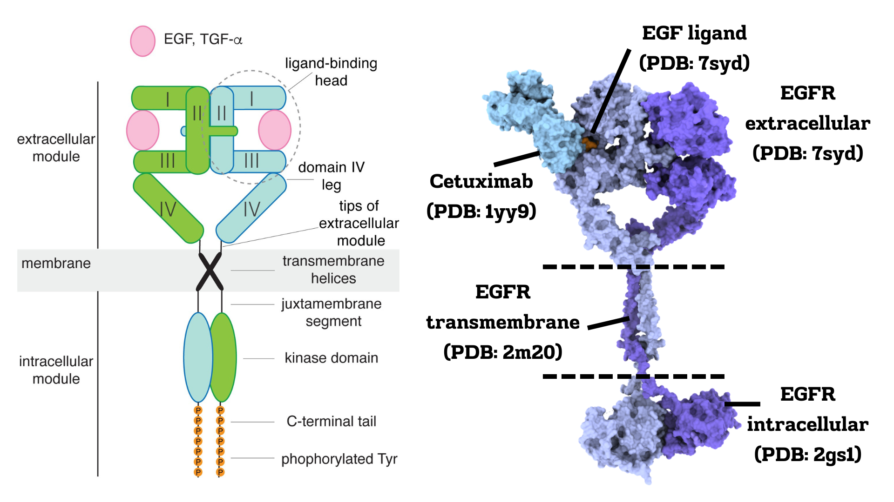
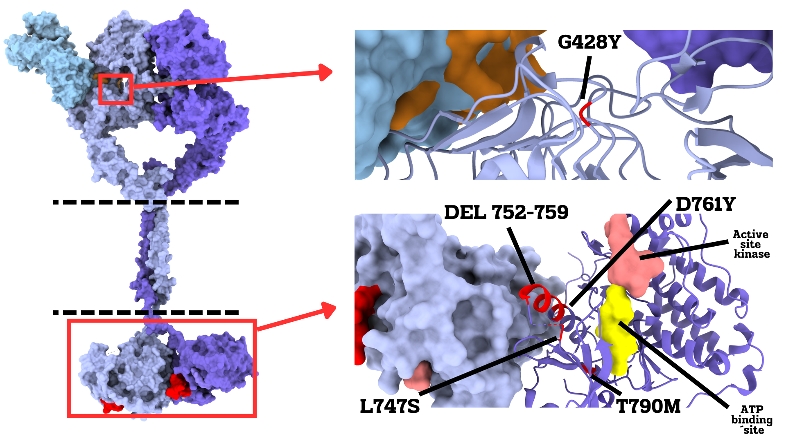

# EGFR-pLM-Pathogenicity

This repository focuses on analyzing EGFR mutations and their impact on therapeutic antibody resistance, leveraging structural modeling and protein language models (pLM). The project integrates patient-specific EGFR mutations with insights from ESM1b to predict variant pathogenicity and explore their roles in therapeutic evasion. 

  
**Figure 1. EGFR Protein Ensemble.** Shows the structural ensemble of EGFR, including extracellular, intracellular, and transmembrane domains. The model features a complex with an antibody and natural ligand (EGF), highlighting the organization of EGFR domains.

  
**Figure 2. EGFR Mutations and Functional Sites.** Focuses on five cancer-associated EGFR mutations (colored red) that are implicated in cetuximab resistance. Active sites for ATP/kinase binding and antibody binding are annotated to emphasize functional regions.

   
**Figure 3. EGFR Pathogenicity Hotspots.** Visualizes predicted pathogenicity across the EGFR protein sequence as a heatmap using ESM1b, a protein language model. Lower scores (depicted in yellow) indicate higher pathogenicity. This aligns with functional insights, such as the protein kinase domain, which is essential for EGFR-mediated phosphorylation and downstream signaling. Mutations in this domain promote phosphorylation even in the absence of EGFR ligand binding, rendering antibody therapies ineffective at blocking the growth signaling cascade. This aberrant activation explains the strong association of these mutations with cancer progression, as predicted by ESM1b.

## References

- Brandes, N., Goldman, G., Wang, C. H., Ye, C. J., & Ntranos, V. (2023). Genome-wide prediction of disease variant effects with a deep protein language model. *Nature Genetics*, 55, 1512–1522. https://www.nature.com/articles/s41588-023-01465-0

## License
This project is licensed under the [MIT License](LICENSE).
